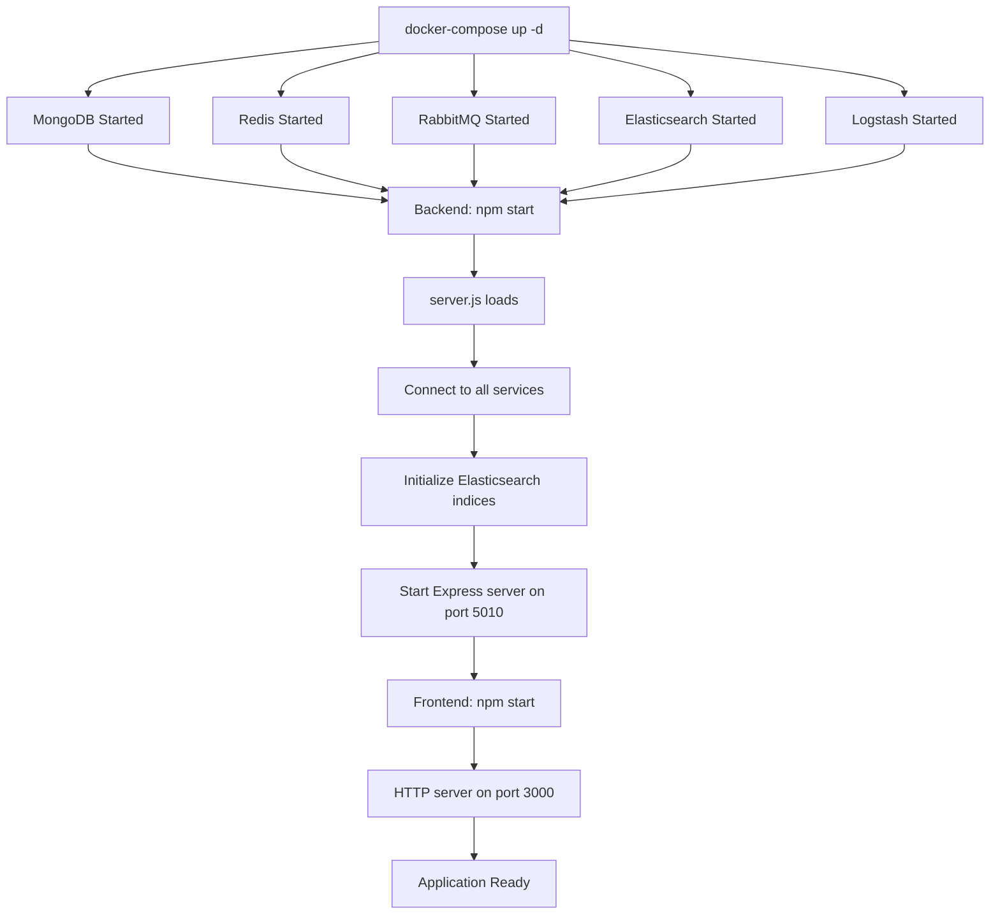
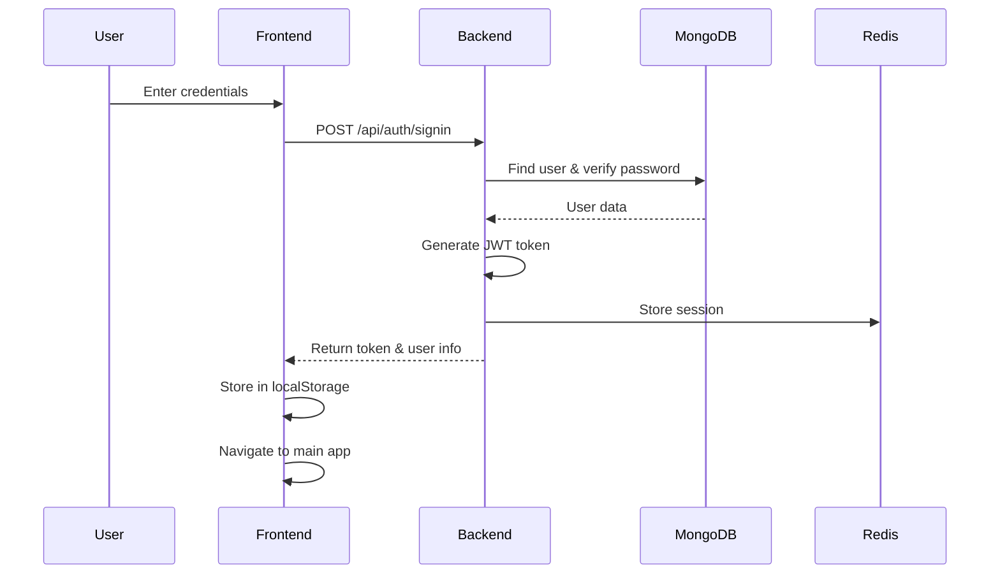
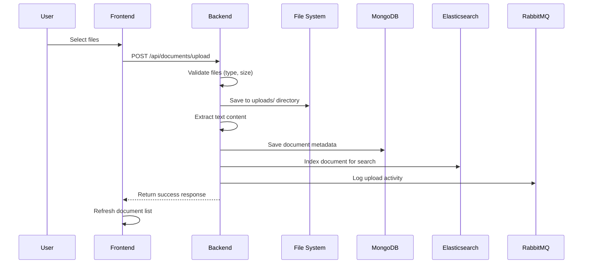
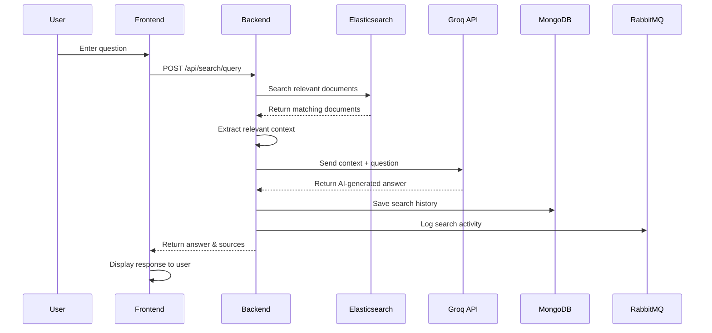

# 📁 Project Structure & Workflow Documentation

Complete overview of the project structure, file organization, and execution workflow.

## 🏗️ Project Directory Structure

```
FINAL/
├── 📄 README.md                    # Main project documentation
├── 📄 TECHNOLOGY_SETUP.md          # Technology installation guide
├── 📄 PROJECT_STRUCTURE.md         # This file - project structure guide
├── 🐳 docker-compose.yml           # Docker services configuration
├── 📄 test-connection.html          # Connection testing utility
│
├── 🗂️ backend/                     # Backend Node.js application
│   ├── 📄 server.js                # Main server entry point
│   ├── 📄 package.json             # Backend dependencies
│   ├── 📄 package-lock.json        # Dependency lock file
│   ├── 📄 .env                     # Environment variables (create from .env.example)
│   ├── 📄 .env.example             # Environment template
│   ├── 📄 logstash.conf            # Logstash configuration
│   │
│   ├── 🗂️ config/                  # Configuration files
│   │   ├── 📄 db.js                # Database connections (MongoDB, Redis, RabbitMQ, Elasticsearch)
│   │   └── 📄 monitoring.js        # Prometheus metrics configuration
│   │
│   ├── 🗂️ middleware/              # Express middleware
│   │   └── 📄 auth.js              # JWT authentication middleware
│   │
│   ├── 🗂️ models/                  # MongoDB data models
│   │   ├── 📄 User.js              # User schema & authentication methods
│   │   ├── 📄 Document.js          # Document metadata schema
│   │   └── 📄 Search.js            # Search history schema
│   │
│   ├── 🗂️ routes/                  # API route handlers
│   │   ├── 📄 auth.js              # Authentication routes (/api/auth/*)
│   │   ├── 📄 documents.js         # Document management routes (/api/documents/*)
│   │   └── 📄 search.js            # Search & query routes (/api/search/*)
│   │
│   ├── 🗂️ services/                # Business logic services
│   │   └── 📄 searchService.js     # AI search & RAG pipeline logic
│   │
│   ├── 🗂️ utils/                   # Utility functions
│   │   ├── 📄 fileParser.js        # Text extraction from files (PDF, DOC, etc.)
│   │   └── 📄 email.js             # Email sending utilities
│   │
│   ├── 🗂️ uploads/                 # File upload storage directory
│   │   └── 📄 [uploaded files]     # User uploaded documents
│   │
│   └── 🗂️ node_modules/            # Backend dependencies (auto-generated)
│
└── 🗂️ frontend/                    # Frontend web application
    ├── 📄 index.html               # Main HTML file (SPA)
    ├── 📄 app.js                   # Frontend JavaScript logic
    ├── 📄 styles.css               # CSS styling
    ├── 📄 package.json             # Frontend dependencies
    ├── 📄 package-lock.json        # Dependency lock file
    ├── 🖼️ favicon.ico              # Website icon
    └── 🗂️ node_modules/            # Frontend dependencies (auto-generated)
```

## 🔄 Application Execution Flow

### 1. System Startup Sequence



### 2. User Authentication Flow



### 3. Document Upload & Processing Flow



### 4. AI Search & Query Flow



## 🗂️ File Responsibilities

### Backend Files

#### Core Server Files
| File | Purpose | Key Functions |
|------|---------|---------------|
| `server.js` | Main entry point | Express setup, middleware, route mounting |
| `package.json` | Dependencies & scripts | npm configuration, start scripts |

#### Configuration
| File | Purpose | Key Functions |
|------|---------|---------------|
| `config/db.js` | Database connections | MongoDB, Redis, RabbitMQ, Elasticsearch clients |
| `config/monitoring.js` | Metrics collection | Prometheus metrics for monitoring |
| `.env` | Environment variables | API keys, database URLs, secrets |

#### Authentication & Security
| File | Purpose | Key Functions |
|------|---------|---------------|
| `middleware/auth.js` | JWT verification | Token validation, user authentication |
| `models/User.js` | User data model | Password hashing, user schema |

#### Data Models
| File | Purpose | Key Functions |
|------|---------|---------------|
| `models/Document.js` | Document metadata | File information, upload tracking |
| `models/Search.js` | Search history | Query logging, recent searches |

#### API Routes
| File | Purpose | Endpoints |
|------|---------|-----------|
| `routes/auth.js` | Authentication | `/signup`, `/signin`, `/forgot-password` |
| `routes/documents.js` | File management | `/upload`, `/list`, `/delete` |
| `routes/search.js` | Search & AI | `/query`, `/recent`, `/status` |

#### Business Logic
| File | Purpose | Key Functions |
|------|---------|---------------|
| `services/searchService.js` | AI processing | RAG pipeline, context extraction, AI calls |
| `utils/fileParser.js` | Text extraction | PDF, DOC, DOCX, TXT parsing |
| `utils/email.js` | Email services | Password reset emails |

### Frontend Files

| File | Purpose | Key Functions |
|------|---------|---------------|
| `index.html` | Main UI structure | SPA layout, forms, chat interface |
| `app.js` | Frontend logic | API calls, UI interactions, state management |
| `styles.css` | Visual styling | Responsive design, animations |
| `package.json` | Frontend dependencies | HTTP server, build tools |

## 🔀 Data Flow Architecture

### 1. Authentication Data Flow
```
User Input → Frontend Validation → Backend Auth → Database Lookup → 
JWT Generation → Redis Session → Response → LocalStorage → UI Update
```

### 2. File Upload Data Flow
```
File Selection → Frontend Upload → Backend Validation → File System Storage → 
Text Extraction → MongoDB Save → Elasticsearch Index → Response → UI Refresh
```

### 3. Search Query Data Flow
```
User Query → Frontend Request → Backend Processing → Elasticsearch Search → 
Context Preparation → AI API Call → Response Generation → Database Log → 
Frontend Display → UI Update
```

### 4. Monitoring & Logging Flow
```
Application Events → RabbitMQ Queue → Logstash Processing → 
Elasticsearch Storage → Monitoring Dashboard
```

## 🔧 Configuration Files

### Docker Compose Services
```yaml
# docker-compose.yml
services:
  mongodb:      # User data, documents, search history
  redis:        # Session cache, token blacklist
  rabbitmq:     # Message queuing for logs
  elasticsearch: # Document search and indexing
  logstash:     # Log processing pipeline
```

### Environment Variables
```bash
# backend/.env
GROQ_API_KEY=          # AI service API key
JWT_SECRET=            # Token signing secret
EMAIL_USER=            # SMTP email username
EMAIL_PASS=            # SMTP email password
MONGODB_URI=           # MongoDB connection string
REDIS_URL=             # Redis connection string
ELASTICSEARCH_URL=     # Elasticsearch connection string
RABBITMQ_URL=          # RabbitMQ connection string
```

## 🚀 Startup Dependencies

### Service Startup Order
1. **Infrastructure Services** (Docker Compose)
   - MongoDB → Database ready
   - Redis → Cache ready
   - RabbitMQ → Message queue ready
   - Elasticsearch → Search engine ready
   - Logstash → Log processing ready

2. **Backend Application**
   - Load environment variables
   - Connect to all services
   - Initialize database indices
   - Start Express server

3. **Frontend Application**
   - Start HTTP server
   - Load static files
   - Connect to backend API

### Health Check Sequence
```bash
# Check service health
curl http://localhost:9200/_cluster/health    # Elasticsearch
curl http://localhost:5010/health             # Backend API
curl http://localhost:3000                    # Frontend
curl http://localhost:15672                   # RabbitMQ Management
```

## 📊 Performance Considerations

### File Size Limits
- **Individual files**: 10MB maximum
- **Total upload**: Unlimited (configurable)
- **Supported formats**: PDF, DOC, DOCX, TXT, PNG, JPG, JPEG

### Database Indexing
- **MongoDB**: Indexed on userId, uploadDate, query
- **Elasticsearch**: Full-text search on document content
- **Redis**: TTL-based session management

### Memory Usage
- **Text extraction**: Temporary memory for file processing
- **AI context**: Limited to 5000 characters per document
- **Search results**: Cached in Elasticsearch

## 🔍 Debugging & Development

### Log Locations
```bash
# Application logs
docker-compose logs backend
docker-compose logs frontend

# Service logs  
docker-compose logs mongodb
docker-compose logs elasticsearch
docker-compose logs rabbitmq

# File system logs
tail -f backend/uploads/debug.log
```

### Development Mode
```bash
# Backend with auto-restart
cd backend && npm run dev

# Frontend with live reload
cd frontend && npm start

# Watch Docker logs
docker-compose logs -f
```

This structure provides a scalable, maintainable architecture for the AI document assistant with clear separation of concerns and comprehensive monitoring capabilities.